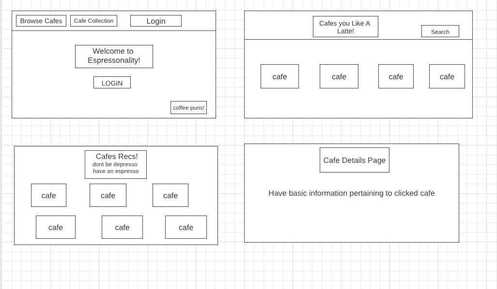
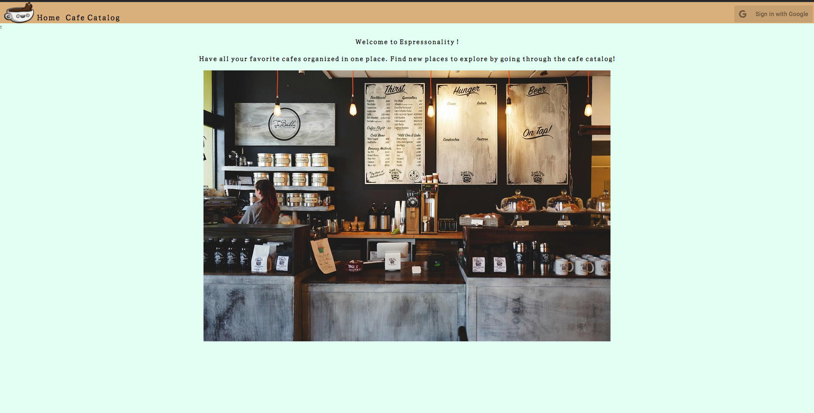
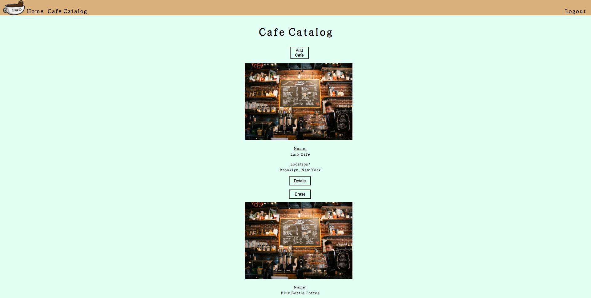

# Espressonality
## Objective
+ Build a full stack application where the user can store and collect their favorite cafes. 
+ Users will be able to navigate to a page where the cafe collection is held.
 + Users will be able to click on a specific cafe which will give them details about the cafe. 
+ Users will be able to view and add cafe reviews to each cafe added or have been previously added. 

## Getting Started: 
### Click [here](https://espressonality.herokuapp.com/) to go to the application. 

## View 

### Wireframe

### Final outloook of the application

## Technology Implemented:
+ Axios
+ dotenv
+ ejs
+ Express
+ Javascript
+ HTML
+ CSS
+ Git
+ Method-Override
+ Mongoose
+ MongoDb
+ Passport.js
+ Google-Oauth 2.0

## Credits
Images from [Pixaby](https://pixabay.com/)

## Stretch Goals
+ Add more profile application interaction
+ Add an additional page for user favorites
